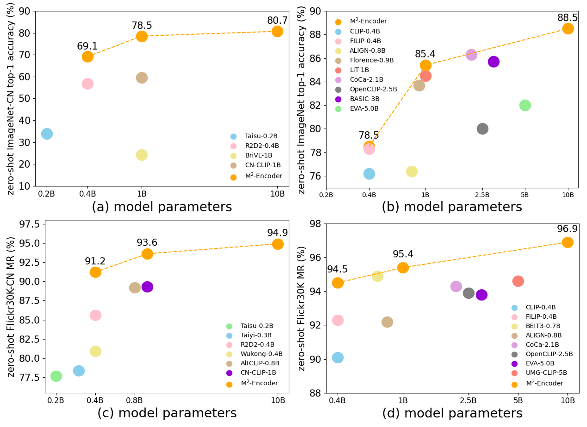

# $M^2$-Encoder: Advancing Bilingual Image-Text Understanding by Large-scale Efficient Pretraining

Official PyTorch implementation of the paper ["M2-Encoder: Advancing Bilingual Image-Text Understanding by Large-scale Efficient Pretraining"](https://arxiv.org/abs/2401.15896).

Pretrained Weights and Demo will be released soon. 

## Abstract
Vision-language foundation models like CLIP have revolutionized the field of artificial intelligence, yet Chinese multimodal foundation models have lagged due to the relative scarcity of large-scale pretraining datasets. Toward this end, we introduce a comprehensive bilingual(Chinese-English) dataset BM-6B with over 6 billion image-text pairs, aimed at enhancing multimodal foundation models, especially for Chinese. To efficiently handle this dataset’s size, we also propose a novel grouped aggregation approach for image-text contrastive loss computation, which reduces the communication overhead and GPU memory demands, facilitating a 60% increase in training speed. We pretrain a series of bilingual image-text foundation models with an enhanced fine-grained understanding ability on BM-6B, the resulting models, dubbed as $M^2$-Encoders(pronounced “M-Square”), set new benchmarks in both languages for multimodal retrieval and classification tasks. Notably, Our largest $M^2$-Encoder-10B model achieves top-1 accuracies of 88.5% on ImageNet and 80.7% on ImageNet-CN under a zero-shot classification setting, surpassing previously reported SoTA methods by 2.2% and 21.1%, respectively. We believe our $M^2$-Encoder series represents one of the most comprehensive bilingual image-text foundation models to date, and we are making it available to the research community for further exploration and development.

## Overall Results
An overview of existing multimodal models on zero-shot classification and retrieval performance. The top-1 accuracy on (a) ImageNet-CN and (b) ImageNet. The retrieval MR on (c) Flicker30K-CN and (d) Flicker30K. Our $M^2$-Encoders excel compared to models with a similar number of parameters.



## Citations
If you find $M^2$-Encoder useful for your work, please consider citing:
```
@misc{guo2024m2encoder,
      title={M2-Encoder: Advancing Bilingual Image-Text Understanding by Large-scale Efficient Pretraining}, 
      author={Qingpei Guo and Furong Xu and Hanxiao Zhang and Wang Ren and Ziping Ma and Lin Ju and Jian Wang and Jingdong Chen and Ming Yang},
      year={2024},
      url={https://arxiv.org/abs/2401.15896},
}
```

