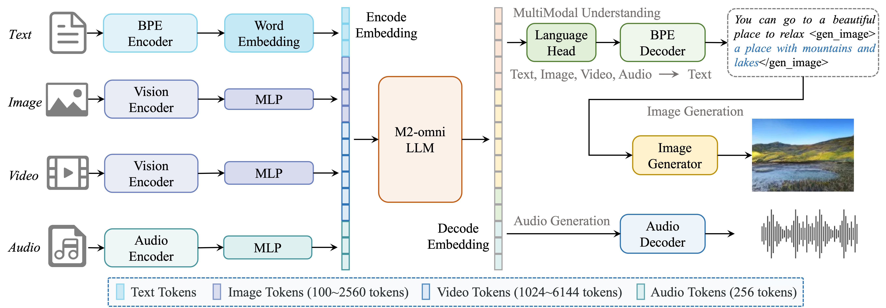

# M2-omni: Advancing Omni-MLLM for Comprehensive Modality Support with Competitive Performance


Official trsnsformers inference code of the paper ["M2-omni: Advancing Omni-MLLM for Comprehensive Modality Support with Competitive Performance"](https://www.arxiv.org/abs/2502.18778).


## Introduction
We present M2-omni, a cutting-edge, open-source omni-MLLM that achieves competitive performance to GPT-4o. M2-omni employs a unified multimodal sequence modeling framework, which empowers Large Language Models(LLMs) to acquire comprehensive cross-modal understanding and generation capabilities. Specifically, M2-omni can process arbitrary combinations of audio, video, image, and text modalities as input, generating multimodal sequences interleaving with audio, image, or text outputs, thereby enabling an advanced and interactive real-time experience. The training of such an omni-MLLM is challenged by significant disparities in data quantity and convergence rates across modalities. To address these challenges, we propose a step balance strategy during pre-training to handle the quantity disparities in modality-specific data. Additionally, a dynamically adaptive balance strategy is introduced during the instruction tuning stage to synchronize the modality-wise training progress, ensuring optimal convergence. Notably, we prioritize preserving strong performance on pure text tasks to maintain the robustness of M2-omni's language understanding capability throughout the training process. To our best knowledge, M2-omni is currently a very competitive open-source model to GPT-4o, characterized by its comprehensive modality and task support, as well as its exceptional performance. We expect M2-omni will advance the development of omni-MLLMs, thus facilitating future research in this domain.

<p align="center">
    
<p>


## Model Downloads

You can download the model from both Huggingface and ModelScope.

<div align="center">

| **Model**              |   **Input modality**    | **Oput modality** |                                                                            **Download**                                                                            |
| :--------------------- | :---------------------: | :---------------: | :----------------------------------------------------------------------------------------------------------------------------------------------------------------: |
| M2-Omni | Image,text,video,audio | Image,text,audio  | [🤖 ModelScope](https://www.modelscope.cn/models/M2Cognition/M2-omni) |
</div>


## Evaluation Results
Detailed evaluation results are reported in our [technical report](https://www.arxiv.org/abs/2502.18778).


## Quick Start 

### Install
```
# create env（python 3.8）
conda create -n m2-omni python=3.8
source activate m2-omni

# clone rep
cd /YourPath/
git clone https://github.com/alipay/Ant-Multi-Modal-Framework

# install
cd ./Ant-Multi-Modal-Framework/prj/M2_omni/
pip install -r requirements.txt
```

### 🤗 Hugging Face Transformers

Here is a code snippet to show you how to use the chat model with `transformers`:

```python
import torch

from transformers import AutoProcessor, AutoTokenizer, GenerationConfig, AutoModelForCausalLM

device = "cuda" if torch.cuda.is_available() else "cpu"

model_name_or_path = "your_model_name_or_path"

# We recommend enabling flash_attention_2 for better acceleration and memory saving, especially in multi-image and video scenarios.
model = AutoModelForCausalLM.from_pretrained(
    model_name_or_path,
    torch_dtype=torch.bfloat16,
    device_map="cuda",
    _attn_implementation="flash_attention_2"
)

# default tokenizer and processer
tokenizer = AutoTokenizer.from_pretrained(model_name_or_path, add_bos_token=True)
processor = AutoProcessor.from_pretrained(model_name_or_path, trust_remote_code=True)

assets_path = YOUR_ASSETS_PATH
```

```python
# QA
messages = [
    {
        "role": "user",
        "content": [
            {"type": "text", "text": "请详细介绍鹦鹉的生活习性。"}
        ],
    },
]
# Output:

# 鹦鹉是一类非常多样化的鸟类，分布在全球各地，尤其是在热带和亚热带地区。它们以鲜艳的羽毛、聪明的智力和模仿人类语言的能力而闻名。以下是对鹦鹉生活习性的详细介绍：
# ### 1. 栖息地\n- **热带雨林** 这是鹦鹉最常见的栖息地，提供了丰富的食物资源和适宜的生存环境。\n- **亚热带森林**：一些种类也分布在亚热带地区，如非洲和澳大利亚。\n- **岛屿**：如加拉帕戈斯群岛上的鹦鹉，生活在独特的岛屿环境中。
# ### 2. 饮食习惯\n- **主要食物**：包括水果、坚果、种子、花蜜、昆虫和小型无脊椎动物。\n- **特殊饮食**：某些种类如金刚鹦鹉，会消耗大量的矿物质和盐分，这些元素在它们的原生栖息地中很难获得。
# ### 3. 社会行为\n- **群居性**：大多数鹦鹉是群居动物，通常以成对或小群体形式生活。\n- **社交结构**：有些种类如非洲灰鹦鹉（灰鹦鹉）有复杂的社会等级系统，而其他种类则较为松散。
# ### 4. 繁殖习性\n- **繁殖季节**：通常在一年中的特定季节进行繁殖，具体时间因种类和地理位置而异。\n- **巢址**：选择树洞、岩石缝隙或其他安全的隐蔽地点筑巢。\n- **蛋卵数量**：一般产卵2-6枚，孵化期约为20-30天。
# ### 5. 逃避和防御机制\n- **飞行能力**：尽管有些种类如非洲灰鹦鹉不会飞，但它们依然能够利用树木和高处躲避捕食者。\n- **叫声和警报**

```

```python
# image qa
messages = [
    {
        "role": "user",
        "content": [
            {"type": "image", "image": os.path.join(assets_path, "plant.png")},
            {"type": "text", "text": "What plant is this?"},
        ],
    },
]
# Output:

# The plant in this image is Dendrobium cruentum, a species of orchid. This orchid is known for its distinctive appearance, featuring long, slender leaves and delicate yellow flowers. Dendrobium cruentum is native to Southeast Asia and is prized by orchid enthusiasts for its unique beauty and relatively easy cultivation compared to some other orchid species. The plant's growth habit, with its upright stems and arching flower stalks, is characteristic of many Dendrobium orchids.
```

```python
# video qa
messages = [
    {
        "role": "user",
        "content": [
            {"type": "video", "video": os.path.join(assets_path, "video1.mp4")},
            {"type": "text", "text": "What is the woman doing?"},
        ],
    },
]
# Output:

# The woman is performing a series of yoga poses on a rooftop.

```

```python
# Video Audio QA
messages = [
    {
        "role": "user",
        "content": [
            {"type": "video", "video": os.path.join(assets_path, "video1.mp4")},
            {"type": "audio", "audio": os.path.join(assets_path, "audioqa.wav")},
        ],
    },
]
outputs = model.generate(messages, max_new_tokens=512)
# Output:

# The woman in the video is doing yoga.
```

```python
# multi-turn chat
messages = [
    {
        "role": "user",
        "content": [
            {"type": "text", "text": "中国的首都是哪里？"},
        ],
    },
    {
        "role": "assistant",
        "content": [
            {"type": "text", "text": "北京"},
        ],
    },
    {
        "role": "user",
        "content": [
            {"type": "text", "text": "它的占地面积是多少？有多少常住人口？"},
        ],
    },
]
# Output:

# 北京市的总面积为16,410.54平方千米，常住人口约为2157万人。
```

```python
# Preparation for inference
text = processor.apply_chat_template(
    messages, tokenize=False, add_generation_prompt=True, use_system=True
)

image_inputs, video_inputs, audio_inputs = processor.process_vision_info(messages)

inputs = processor(
    text=[text],
    images=image_inputs,
    videos=video_inputs,
    audios=audio_inputs,
    return_tensors="pt",
)

inputs = inputs.to(device)
for k in inputs.keys():
    if k == "pixel_values" or k == "pixel_values_videos":
        inputs[k] = inputs[k].to(dtype=torch.bfloat16)

# setting generation configure
generation_config = {
    "top_p": 0.8,
    "top_k": 100,
    "temperature": 0.7,
    "do_sample": True,
    "repetition_penalty": 1.05
}
generation_config = GenerationConfig.from_dict(generation_config)

# Inference: Generation of the output
with torch.no_grad():
    generated_ids = model.generate(
        **inputs, max_new_tokens=512,
        eos_token_id=processor.gen_terminator,
        generation_config=generation_config,
    )

generated_ids_trimmed = [
    out_ids[len(in_ids) :] for in_ids, out_ids in zip(inputs.input_ids, generated_ids)
]
output_text = processor.batch_decode(
    generated_ids_trimmed, skip_special_tokens=True, clean_up_tokenization_spaces=False
)
print(output_text)
```

## Citations
If you find M2-omni useful for your work, please consider citing:
```
@misc{guo2025m2omniadvancingomnimllmcomprehensive,
      title={M2-omni: Advancing Omni-MLLM for Comprehensive Modality Support with Competitive Performance}, 
      author={Qingpei Guo and Kaiyou Song and Zipeng Feng and Ziping Ma and Qinglong Zhang and Sirui Gao and Xuzheng Yu and Yunxiao Sun and Tai-Wei Chang and Jingdong Chen and Ming Yang and Jun Zhou},
      year={2025},
      eprint={2502.18778},
      archivePrefix={arXiv},
      primaryClass={cs.LG},
      url={https://arxiv.org/abs/2502.18778}, 
}
```

## License and Legal Disclaimer

This code repository is licensed under the [MIT License](../../LICENSE.txt), and the Legal Disclaimer is located in the [LEGAL.md file](../../LEGAL.md) under the project's root directory.
