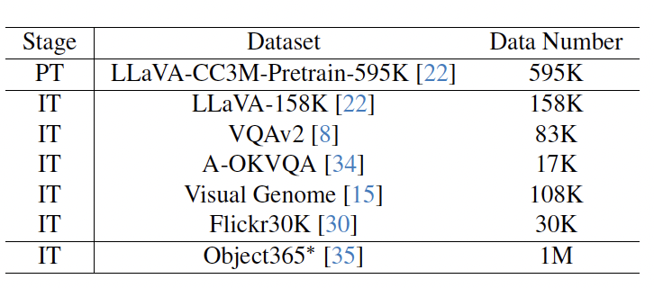

# Pink: Unveiling The Power of Referential Comprehension for Multi-modal LLMs. 

## Contents
- [Data Download](#data-download)
- [Install](#install)
- [Training](#training)
- [Evaluation](#evaluation)
- [Demo](#demo)

## Pink Weights

- Base: [Pink_Base](https://huggingface.co/SY-Xuan/Pink_base)
- Base_Object365: [Pink_Object365](https://huggingface.co/SY-Xuan/Pink_object365)
- Base_RefCOCO: [Pink_Refcoco](https://huggingface.co/SY-Xuan/Pink_RefCOCO)

## Data Download

### Pretraining Dataset
The pretraining dataset used in this release is the same as in LLaVA which is a subset of CC-3M dataset. Please see [here](https://huggingface.co/datasets/liuhaotian/LLaVA-CC3M-Pretrain-595K) for a detailed description on the dataset structure and how to download the images.

### Instruction Tuning Dataset


The datasets mentioned in the image need to be downloaded manually.

- COCO: [train2017](http://images.cocodataset.org/zips/train2017.zip)
- VisualGenome: [part1](https://cs.stanford.edu/people/rak248/VG_100K_2/images.zip), [part2](https://cs.stanford.edu/people/rak248/VG_100K_2/images2.zip), [objects](https://homes.cs.washington.edu/~ranjay/visualgenome/data/dataset/objects_v1_2.json.zip), [relationships](https://homes.cs.washington.edu/~ranjay/visualgenome/data/dataset/relationships_v1_2.json.zip), [region descriptions](https://homes.cs.washington.edu/~ranjay/visualgenome/data/dataset/region_descriptions.json.zip)
- Object365: [Object365](http://www.objects365.org/download.html)
- A-OKVQA: [A-OKVQA](https://prior-datasets.s3.us-east-2.amazonaws.com/aokvqa/aokvqa_v1p0.tar.gz)
- LLaVA-158K: [LLaVA-158K](https://huggingface.co/datasets/liuhaotian/LLaVA-Instruct-150K/blob/main/llava_instruct_150k.json)

We also provide the converted dataset used in the instruction tuning:

https://huggingface.co/datasets/SY-Xuan/Pink_sft/

## LLaMA2 Weight Download
Our model is based on **Llama-2-7b-chat-hf**. You need to download the weights manually.

- Llama-2-7b-chat-hf: [Llama-2-7b-chat-hf](https://huggingface.co/meta-llama/Llama-2-7b-chat-hf)

## Install
1. Install Package
```Shell
conda create -n pink python=3.10 -y
conda activate pink
pip install --upgrade pip  # enable PEP 660 support
pip install -e .
```


## Training
### Stage 1
Please refer to **scripts/stage1.sh**.

### Stage 2
Please refer to **scripts/stage2.sh**.

### Stage 2 with Object365
Please refer to **scripts/stage2_with_object365.sh**.

## Self-consistent Bootstrapping
We convert the *.json of Object365. Please refer to **dataset_generation/object365_detection.py**

### Bootstrapping
Please refer to **scripts/object365_generate.sh**.

### Self-consistent
Please refer to **scripts/object365_filter.py**

## Evaluation
Please refer to **inference.ipynb** and **scripts/eval_refcoco.sh**.

## Demo
To launch a Gradio web demo, use the following command.
```
python demo.py --checkpoint-path /path/to/pink --llama-path /path/to/llama2
```

## Citation
If you find Pink useful for your research and applications, please cite using this BibTeX:

```
@article{xuan2023pink,
  title={Pink: Unveiling the power of referential comprehension for multi-modal llms},
  author={Xuan, Shiyu and Guo, Qingpei and Yang, Ming and Zhang, Shiliang},
  journal={arXiv preprint arXiv:2310.00582},
  year={2023}
}
```

## Acknowledgement
- [LLaVA](https://github.com/haotian-liu/LLaVA): the codebase we refer to.
- [Shikra](https://github.com/shikras/shikra): the codebase we refer to.

## Related Projects
[LocLLM](https://github.com/kennethwdk/LocLLM): We leverage LLM for the human keypoint localization. LocLLM shows remarkable performance on standard 2D/3D keypoint localization benchmarks. Moreover, incorporating language clues into the localization makes LocLLM show superior flexibility and generalizable capability in cross dataset keypoint localization, and even detecting novel type of keypoints unseen during training.

[Ant-Multi-Modal-Framework](https://github.com/alipay/Ant-Multi-Modal-Framework): This repository contains codes for multi-modality learning from the Multimodal Cognition group of Ant Group that have been integrated into AntMMF.
