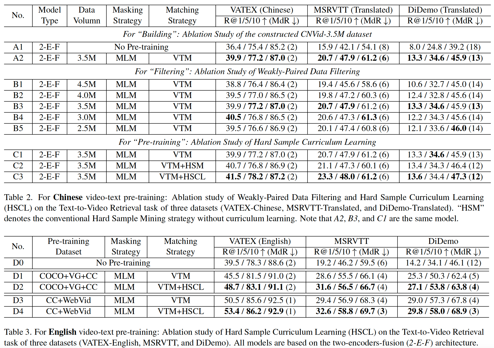

# CNVid-VTP 训练代码指南

该子代码库为CNVid-3.5M论文的配套训练代码指南。

## Installation （安装指南）

- CNVid-VTP的安装步骤如下所示：
```
# 新建环境（Python版本3.8）
conda create -n cnvid-vtp python=3.8
source activate cnvid-vtp

# clone项目地址
cd /YourPath/
git clone https://github.com/alipay/Ant-Multi-Modal-Framework

# 安装包依赖
cd antmmf
pip install -r requirements.txt
```

## Dataset (数据集)

CNVid-VTP支持在以下的公开数据集上进行预训练或微调操作：
- 预训练数据集：
  - 图文数据集，支持`COCO`，`VG`，`CC3M`等数据集；
  - 视频文本数据集，支持`WebVid-2M`，`CNVid-3.5M`（中文）等数据集。
- 微调数据集：
  - 跨模态检索数据集，支持`MSRVTT`，`DiDemo`，`VATEX`等数据集。

## Performance Results （结果指标）

CNVid-VTP在多个中英文公开视频理解数据集上的结果如下所示：



## Quick Start （快速启动）

CNVid-VTP提供了本地测试脚本，可以快速进行安装正确性验证：
```
# 终端运行
sh prj/cnvid_vtp/scripts/local_test/coco_vg.local.sh
```

## Pre-Training （预训练）

CNVid-VTP提供了多个数据集上的预训练脚本，具体详见`prj/cnvid_vtp/scripts/pretrain`。

预训练时，可以通过 1）命令行，2）sh脚本，3）yml文件 这三种方式控制预训练进程，其优先级顺序为：命令行 > sh脚本 > yml文件。

下面以在CNVid中文视频文本数据集上预训练为例，展示CNVid-VTP的预训练流程：

- 下载CNVid数据集
- 修改prj/cnvid_vtp/configs/univl/video/pretrain/CN_video_videoswin.yml中的`data_root_dir`字段
- 运行prj/cnvid_vtp/scripts/pretrain/CN_cnvid_pt_videoswin.sh脚本，其中一些重要字段的含义是：

```
python -m antmmf.utils.launch \
    --nproc_per_node=8 --master_port=12371  prj/cnvid_vtp/run.py \
    --config ${CONFIG} \                                # config文件路径
    training_parameters.distributed True \              # 是否进行分布式数据读取和训练
    training_parameters.run_type train \                # 当前运行状态（train->训练，predict->测试）    
    training_parameters.restart True \                  # 是否重新开始训练（False的话会重置训练轮数）
    task_attributes.univl_task.dataset_attributes.video_text_pretrain.train_ensemble_n_clips 4 \  # 训练时每个视频的抽帧数
    task_attributes.univl_task.dataset_attributes.video_text_pretrain.test_ensembel_n_clips 4 \   # 测试时每个视频的抽帧数
    training_parameters.batch_size 128 \                # 训练size
    training_parameters.test_batch_size 64 \            # 测试size
    optimizer_attributes.params.lr 5e-5 \               # 学习率
    optimizer_attributes.params.weight_decay 1e-3 \     # 学习率衰减率
    training_parameters.enable_amp False \              # 是否开启混合精度训练
    training_parameters.save_dir ${SAVE_DIR}/test \     # 训练结果保存地址
    model_attributes.univl.hard_example_mining True \   # 是否使用难例挖掘
    model_attributes.univl.change_iter 5000 \           # 课程学习的迭代步长
    model_attributes.univl.change_rate 0.15 \           # 课程学习的迭代步幅
```

## Fine-Tuning （微调）

CNVid-VTP提供了多个数据集上的微调脚本，具体详见`prj/cnvid_vtp/scripts/finetune`。

微调的流程和逻辑与预训练类似，但需要注意为`training_parameters.resume_file`赋值，该字段会读取对应checkpoint的文件参数。

## Inference （推理）

CNVid-VTP支持使用已训练/微调好的模型进行测试。

注意在测试时，须将`training_parameters.run_type`字段置为`predict`，
并且`training_parameters.resume_file`须指向一个已充分收敛的模型。

## FAQ （问答）
