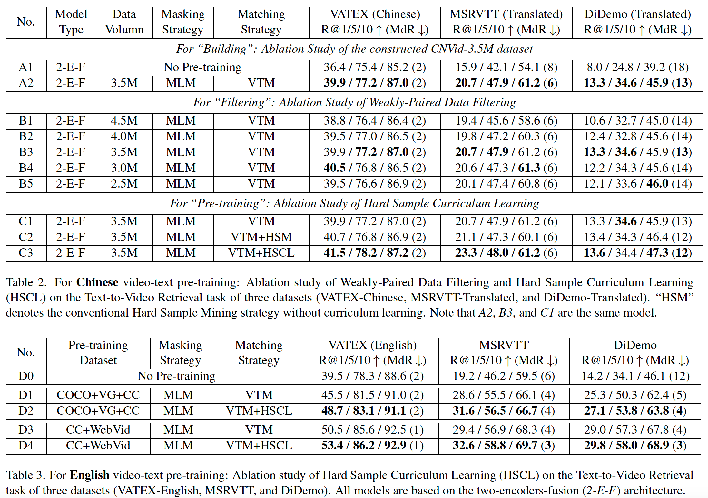

# CNVid-VTP Pre-training Codebase

This codebase is now mainly used for pre-training on our CNVid-3.5M dataset.

## Installation

- Please follow the forward steps to initialize the environment of the CNVid-VTP.
```
# Build a new environment.
conda create -n cnvid-vtp python=3.8
source activate cnvid-vtp

# Clone this project.
cd /YourPath/
git clone https://github.com/alipay/Ant-Multi-Modal-Framework

# Install the required packages.
cd antmmf
pip install -r requirements.txt
```

## Dataset

CNVid-VTP supports the following public datasets for multi-modal pre-training and fine-tuning.
- Pre-training datasets：
  - Image-text datasets: *e.g.*, `COCO`，`VG`，and `CC3M`.
  - Video-text datasets: *e.g.*, `WebVid-2M`，and `CNVid-3.5M`(Chinese).
- Fine-tuning datasets：
  - Cross-modal retrieval datasets: *e.g.*, `MSRVTT`，`DiDemo`，and `VATEX`；

## Performance Results

Performance comparisons on three public Chinese/English datasets.



## Quick Start

CNVid-VTP provides the following script for local test.
```
sh prj/cnvid_vtp/scripts/local_test/coco_vg.local.sh
```

## Pre-Training

CNVid-VTP provides various pre-training scripts, please follow `prj/cnvid_vtp/scripts/pretrain` for more information.

The following shell command is an example to start the video-text pre-training on the CNVid-3.5M dataset.

```
python -m antmmf.utils.launch \
    --nproc_per_node=8 --master_port=12371  prj/cnvid_vtp/run.py \
    --config ${CONFIG} \                                
    training_parameters.distributed True \              
    training_parameters.run_type train \                
    training_parameters.restart True \                  
    training_parameters.batch_size 128 \                
    training_parameters.test_batch_size 64 \            
    optimizer_attributes.params.lr 5e-5 \               
    optimizer_attributes.params.weight_decay 1e-3 \     
    training_parameters.enable_amp False \
    training_parameters.save_dir ${SAVE_DIR}/test \
    model_attributes.univl.hard_example_mining True \
    model_attributes.univl.change_iter 5000 \
    model_attributes.univl.change_rate 0.15 \ 
```

## Fine-Tuning

CNVid-VTP provides various pre-training scripts, please follow `prj/cnvid_vtp/scripts/finetune` for more information.

The pipeline of fine-tuning is the same as pre-training.

## Inference

CNVid-VTP supports inference with a well pre-trained model.

## FAQ
