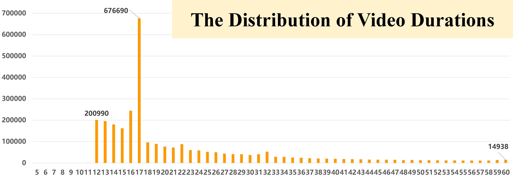
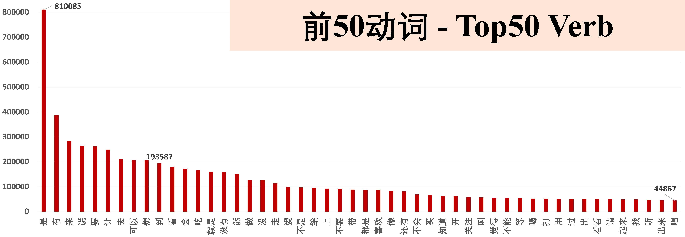
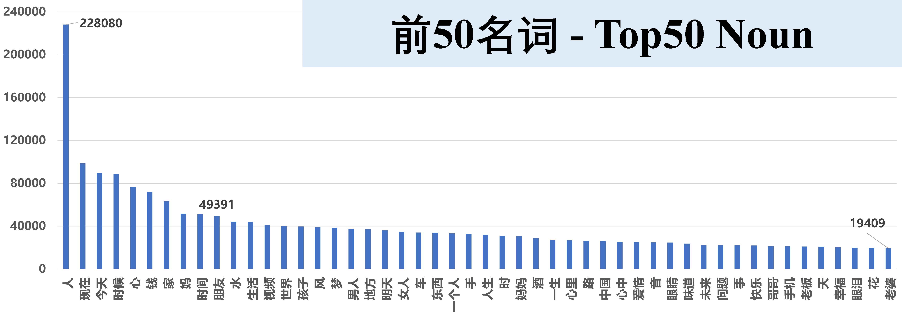
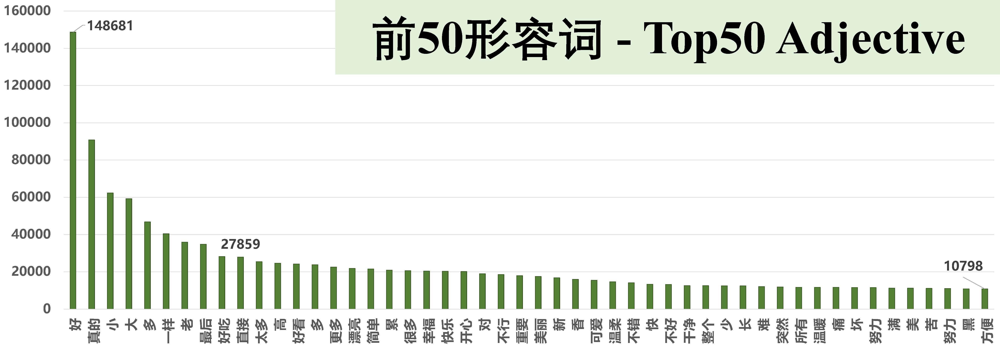

## DATASET
The CNVid-3.5M dataset is a large-scale video-text Chinese dataset.

## Download
Download link is now available：[https://drive.google.com/drive/folders/1ACVN2Zb_XoY5IpMrkfbKqEIJfhleMSDO?usp=share_link](https://drive.google.com/drive/folders/1ACVN2Zb_XoY5IpMrkfbKqEIJfhleMSDO?usp=share_link).

We provide the following files:

* cn_vid3_5m_v1.csv: This CSV contains all of the CNVid video urls.

* caption.json: This json file contains the captions for all the CNVid videos. It is stored as a dictionary where each key is a video_id.
Each value of the dictionary is another dictionary with the keys ['text', 'start', 'end'] where the value of 'text' is a list of all the captions from the given video_id,
and 'start' and 'end' are arrays correspondings to the start and end time timestamp of the captions (in second).

It is recommended to use [SVD-download](https://github.com/svdbase/SVD-download) to download the original videos in the CNVid-3.5M dataset.

* Another instruction/project that may be helpful to download original videos in the CNVid-3.5M dataset: https://github.com/NanmiCoder/MediaCrawler

## Statistics
* The CNVid-3.5M dataset contains **3.5 Million** <video, text> pairs.
* **Topics:**  CNVid-3.5M contains a total of 5.7 Million topics,
and each video has 1.63 topics on average.
* **Keywords:**  CNVid-3.5M contains a total of 21.5 Million keywords, and each video has 6.15 keywords on average.
* **Video Durations:** The maximum, minimum, and average video duration of CNVid-3.5M is 1,974s, 4s, and 36.34s, respectively.
* **PoS Tags of the ASR Text:** CNVid-3.5M contains a total of 17.0 Million verbs, 9.1 Million nouns, and 3.2Million adjectives, respectively.

