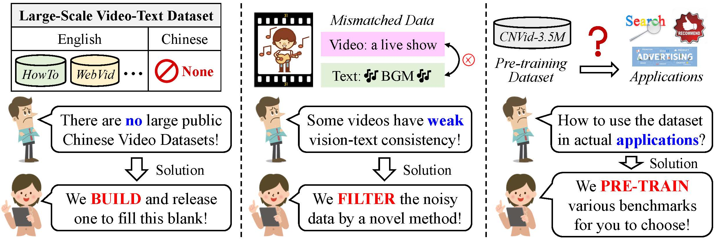

# CNVid-3.5M: Build, Filter, and Pre-train the Large-scale Public Chinese Video-text Dataset

This repository contains the dataset, codebase, and benchmarks for our paper: <[CNVid-3.5M: Build, Filter, and Pre-train the Large-scale Public Chinese Video-text Dataset](https://openaccess.thecvf.com/content/CVPR2023/papers/Gan_CNVid-3.5M_Build_Filter_and_Pre-Train_the_Large-Scale_Public_Chinese_Video-Text_CVPR_2023_paper.pdf)>, which has been accepted by CVPR 2023.



## IMPORTANT!

Please first check [TERMS.md](https://github.com/alipay/Ant-Multi-Modal-Framework/blob/main/prj/cnvid_vtp/TERMS.md), [LEGAL.md](https://github.com/alipay/Ant-Multi-Modal-Framework/blob/main/prj/cnvid_vtp/LEGAL.md), and [LICENSE](https://github.com/alipay/Ant-Multi-Modal-Framework/blob/main/prj/cnvid_vtp/LICENSE). You must not use the content in this dataset if you do not agree to the terms, legal disclaimer, and license outlined in these files.

We note that we do not own the copyright to any of the collected data. The distribution of identities and activities in the CNVid-3.5M dataset may not be representative of the global human population and the diversity in society. Please be careful of unintended societal, gender, racial, and other biases when training or deploying models trained on this data.

## What is CNVid-3.5M?

**CNVid-3.5M** is a large-scale public cross-modal dataset containing over 3.5 Million **Chinese** video-text pairs. We summarize our contributions by three verbs, i.e., “Build”, “Filter”, and “Pre-train”: 1) To build a public Chinese video-text dataset, we collect over 4.5M videos from Chinese websites. 2) To improve the data quality, we propose a novel method to filter out 1M weakly-paired videos, resulting in the **CNVid-3.5M** dataset.

## Dataset

Check [DATASET.md](https://github.com/alipay/Ant-Multi-Modal-Framework/blob/main/prj/cnvid_vtp/DATASET.md) for instructions of dataset downloading and preprocessing (CNVid-3.5M).

## Codebase

Check [CODEBASE.md (中文)](https://github.com/alipay/Ant-Multi-Modal-Framework/blob/main/prj/cnvid_vtp/CODEBASE_CN.md) or [CODEBASE.md (English)](https://github.com/alipay/Ant-Multi-Modal-Framework/blob/main/prj/cnvid_vtp/CODEBASE_EN.md) for instructions of codebase downloading and model pre-training (CNVid-3.5M).

## Citation

If you find CNVid-3.5M useful, please consider citing the following paper:

```
@inproceedings{gan2023cnvid,
  title={CNVid-3.5 M: Build, Filter, and Pre-Train the Large-Scale Public Chinese Video-Text Dataset},
  author={Gan, Tian and Wang, Qing and Dong, Xingning and Ren, Xiangyuan and Nie, Liqiang and Guo, Qingpei},
  booktitle={Proceedings of the IEEE Conference on Computer Vision and Pattern Recognition},
  pages={14815--14824},
  year={2023}
}
```
### The word cloud for Top-200 TOPICs in CNVid-3.5M.


### The word cloud for Top-200 KEYWORDs in CNVid-3.5M.

