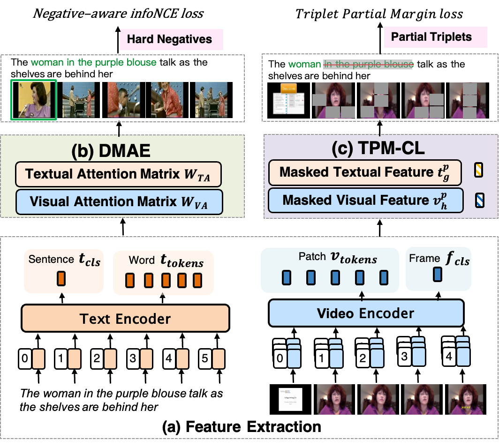

# DMAE/TPM-CL: Dual-Modal Attention-Enhanced Text-Video Retrieval with Triplet Partial Margin Contrastive Learning

This repository contains the codebase for our paper
[Dual-Modal Attention-Enhanced Text-Video Retrieval with Triplet Partial Margin Contrastive Learning](https://arxiv.org/pdf/2309.11082.pdf), which has been accepted by ACM MM2023.

## Abstract

In recent years, the explosion of web videos makes text-video retrieval increasingly essential and popular for video filtering, recommendation, and search. Text-video retrieval aims to rank relevant text/video higher than irrelevant ones. The core of this task is to precisely measure the cross-modal similarity between texts and videos. Recently, contrastive learning methods have shown promising results for text-video retrieval, most of which focus on the construction of positive and negative pairs to learn text and video representations. Nevertheless, they do not pay enough attention to hard negative pairs and lack the ability to model different levels of semantic similarity. To address these two issues, this paper improves contrastive learning using two novel techniques. First, to exploit hard examples for robust discriminative power, we propose a novel Dual-Modal Attention-Enhanced Module (DMAE) to mine hard negative pairs from textual and visual clues. By further introducing a Negative-aware InfoNCE (NegNCE) loss, we are able to adaptively identify all these hard negatives and explicitly highlight their impacts in the training loss. Second, our work argues that triplet samples can better model fine-grained semantic similarity compared to pairwise samples. We thereby present a new Triplet Partial Margin Contrastive Learning (TPM-CL) module to construct partial order triplet samples by automatically generating fine-grained hard negatives for matched text-video pairs. The proposed TPM-CL designs an adaptive token masking strategy with cross-modal interaction to model subtle semantic differences. Extensive experiments demonstrate that the proposed approach outperforms existing methods on four widely-used text-video retrieval datasets, including MSR-VTT, MSVD, DiDeMo and ActivityNet.




## Citation

If you find DMAE/TPM-CL useful, please consider citing the following paper:

```
@inproceedings{Jiang2023DualModalAT,
  title={Dual-Modal Attention-Enhanced Text-Video Retrieval with Triplet Partial Margin Contrastive Learning},
  author={Chen, Jiang and Hong, Liu and Xuzheng, Yu and Qing, Wang and Yuan, Cheng and Jia, Xu and Zhongyi, Liu and Qingpei, Guo and Wei, Chu and Ming, Yang and Yuan, Qi},
  booktitle={Proceedings of the 31st ACM International Conference on Multimedia (ACM MM)},
  year={2023},
  pages={4626–4636},
  doi={https://doi.org/10.1145/3581783.3612006}
}
```
