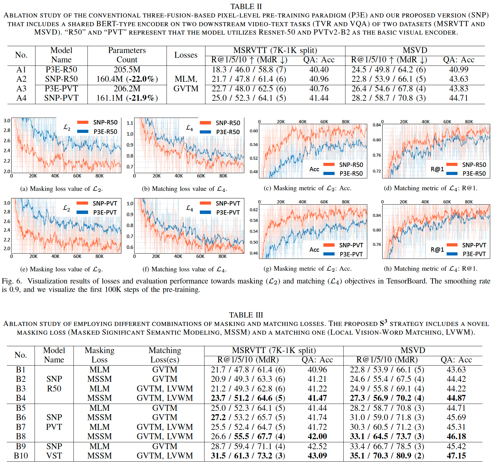

# SNP-S3 Video-Text Pre-training （SNP-S3-VTP）

该子代码库为TCSVT（CCF-B）被接收论文，SNP-S3的代码库。SNP-S3用于细粒度的视频文本预训练任务，可支持多类具体的下游任务。

## Installation （安装指南）

- SNP-S3-VTP的安装步骤如下所示：
```
# 新建环境（Python版本3.8）
conda create -n snps3-vtp python=3.8
source activate snps3-vtp

# clone项目地址
cd /YourPath/
git clone https://github.com/alipay/Ant-Multi-Modal-Framework

# 安装包依赖
cd antmmf
pip install -r requirements.txt
```

## Dataset (数据集)

SNP-S3-VTP支持在以下的公开数据集上进行预训练或微调操作：
- 预训练数据集：
  - 图文数据集，支持`COCO`，`VG`，`CC3M`等数据集；
  - 视频文本数据集，支持`WebVid-2M`数据集。
- 微调数据集：
  - 跨模态检索数据集，支持`MSRVTT`，`DiDemo`，`MSVD`等数据集；
  - 视频问答数据集，支持`MSRVTT-QA`，`MSVD-QA`等数据集；
  - 多选项视频问答数据集，支持`MSRVTT-MC-QA`等数据集。

## Performance Results （结果指标）

SNP-S3-VTP在多个公开视频理解数据集上的结果如下所示：


## Ablation Results （消融实验）

SNP-S3-VTP的消融实验结果如下所示：



## Quick Start （快速启动）

SNP-S3-VTP提供了本地测试脚本，可以快速进行安装正确性验证：
```
# 终端运行
sh prj/snps3_vtp/scripts/local_test/snps3_quick_test.sh
```

## Pre-Training （预训练）

SNP-S3-VTP提供了多个数据集上的预训练脚本，具体详见`prj/snps3_vtp/scripts/pretrain`。

预训练时，可以通过 1）命令行，2）sh脚本，3）yml文件 这三种方式控制预训练进程，其优先级顺序为：命令行 > sh脚本 > yml文件。

下面以在COCO+VG图文数据集上预训练为例，展示SNP-S3-VTP的预训练流程：

- 下载COCO+VG数据集
- 修改prj/snps3_vtp/configs/univl/video/pretrain/coco_vg_pvt.yml中的`data_root_dir`字段
- 运行prj/snps3_vtp/scripts/pretrain/coco_vg_pvt.sh脚本，其中一些重要字段的含义是：

```
python -m antmmf.utils.launch \
    --nproc_per_node=8 --master_port=12371  prj/snps3_vtp/run.py \
    --config ${CONFIG} \                                # config文件路径
    training_parameters.distributed True \              # 是否进行分布式数据读取和训练
    training_parameters.run_type train \                # 当前运行状态（train->训练，predict->测试）    
    training_parameters.restart True \                  # 是否重新开始训练（False的话会重置训练轮数）
    training_parameters.batch_size 128 \                # 训练size
    training_parameters.test_batch_size 64 \            # 测试size
    optimizer_attributes.params.lr 5e-5 \               # 学习率
    optimizer_attributes.params.weight_decay 1e-3 \     # 学习率衰减率
    training_parameters.enable_amp True \               # 是否开启混合精度训练
    training_parameters.save_dir ${SAVE_DIR}/test \     # 训练结果保存地址
    task_attributes.univl_task.dataset_attributes.video_text_pretrain.processors.caption_processor.params.intra_VTM.IW_MLM True \ # 开启MSSM
    model_attributes.univl.pretraining_heads.Vision_Word_Matching True \ # 开启LVWM
    model_attributes.univl.pretraining_heads.MASK_All_IWords_info.VWM_count_stage "after" \ # LVWM的计算阶段控制
    model_attributes.univl.pretraining_heads.MASK_All_IWords_info.Word_Chosen_Num 3         # LVWM的计算token数
```

## Fine-Tuning （微调）

SNP-S3-VTP提供了多个数据集上的微调脚本，具体详见`prj/snps3_vtp/scripts/finetune`。

微调的流程和逻辑与预训练类似，但需要注意为`training_parameters.resume_file`赋值，该字段会读取对应checkpoint的文件参数。

## Inference （推理）

SNP-S3-VTP支持使用已训练/微调好的模型进行测试，测试的脚本可类比`prj/snps3_vtp/scripts/finetune/multi_choice_qa/msr_vtt_mc_qa_videoswin.sh`文件。

注意在测试时，须将`training_parameters.run_type`字段置为`predict`，
并且`training_parameters.resume_file`须指向一个已充分收敛的模型。

## Significant Semantic Mining （重要语义词汇挖掘）

我们提供了自动化的重要语义词汇挖掘算法，可用于发现指定数据集中的重要词汇，具体流程可参考：`prj/snps3_vtp/auxiliary_files/generate_ss_word_json`。

## FAQ （问答）
