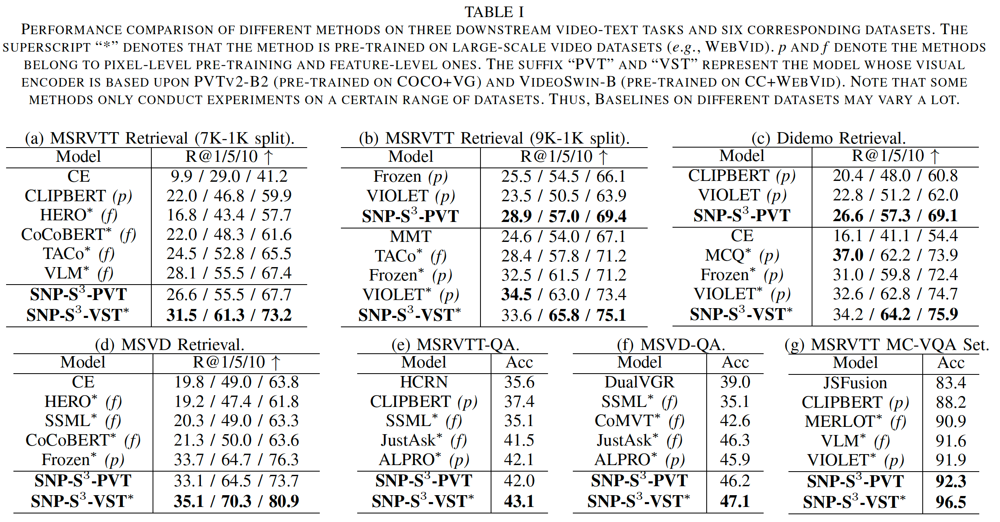

# SNP-S3 Video-Text Pre-training （SNP-S3-VTP）

This codebase is now mainly used for multi-modal fine-grained image/video pre-training of SNP-S3.

## Installation

- Please follow the forward steps to initialize the environment of the SNP-S3.
```
# Build a new environment.
conda create -n snps3-vtp python=3.8
source activate snps3-vtp

# Clone this project.
cd /YourPath/
git clone https://github.com/alipay/Ant-Multi-Modal-Framework

# Install the required packages.
cd antmmf
pip install -r requirements.txt
```

## Dataset

SNP-S3 supports the following public datasets for multi-modal pre-training and fine-tuning.
- Pre-training datasets：
  - Image-text datasets: *e.g.*, `COCO`，`VG`，and `CC3M`.
  - Video-text datasets: *e.g.*, `WebVid-2M`.
- Fine-tuning datasets：
  - Cross-modal retrieval datasets: *e.g.*, `MSRVTT`，`DiDemo`，`MSVD`；
  - Video qusetion-answering datasets: *e.g.*, `MSRVTT-QA`，and `MSVD-QA`；
  - Multi-choice video qusetion-answering datasets: *e.g.*, `MSRVTT-MC-QA`.

## Performance Results



## Ablation Results


## Quick Start

SNP-S3 provides the following script for local test.
```
sh prj/snps3_vtp/scripts/local_test/snps3_quick_test.sh
```

## Pre-Training

SNP-S3 provides various pre-training scripts, please follow `prj/snps3_vtp/scripts/pretrain` for more information.

The following shell command is an example to start the image-text pre-training on COCO-VG datasets.

```
python -m antmmf.utils.launch \
    --nproc_per_node=8 --master_port=12371 prj/snps3_vtp/run.py \
    --config ${CONFIG} \                                
    training_parameters.distributed True \              
    training_parameters.run_type train \                
    training_parameters.restart True \                  
    training_parameters.batch_size 128 \                
    training_parameters.test_batch_size 64 \            
    optimizer_attributes.params.lr 5e-5 \               
    optimizer_attributes.params.weight_decay 1e-3 \     
    training_parameters.enable_amp True \               
    training_parameters.save_dir ${SAVE_DIR}/test \
    task_attributes.univl_task.dataset_attributes.video_text_pretrain.processors.caption_processor.params.intra_VTM.IW_MLM True \
    model_attributes.univl.pretraining_heads.Vision_Word_Matching True \
    model_attributes.univl.pretraining_heads.MASK_All_IWords_info.VWM_count_stage "after" \
    model_attributes.univl.pretraining_heads.MASK_All_IWords_info.Word_Chosen_Num 3  
```

## Fine-Tuning

SNP-S3 provides various pre-training scripts, please follow `prj/snps3_vtp/scripts/finetune` for more information.

The pipeline of fine-tuning is the same as pre-training.

## Inference

SNP-S3 supports inference with a well pre-trained model, please follow `prj/snps3_vtp/scripts/finetune/multi_choice_qa/msr_vtt_mc_qa_videoswin.sh` for more information.

## Significant Semantic Mining

We provide the Significant Semantic Mining function to automatically obtain Significant Words within the dataset, 
the pipeline is available at `prj/snps3_vtp/auxiliary_files/generate_ss_word_json`.


## FAQ
